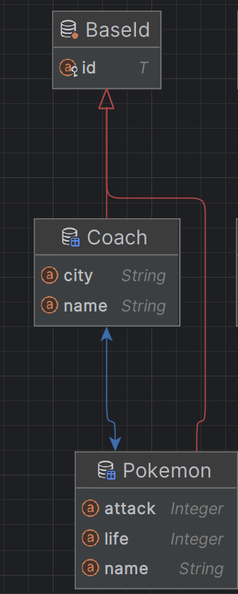
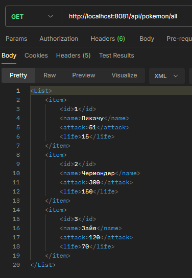
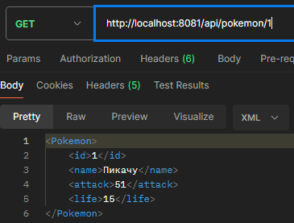
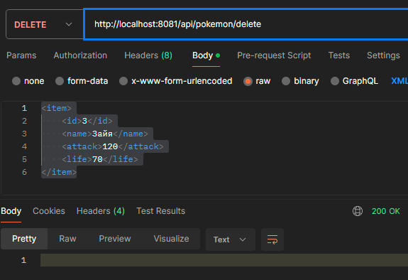

lab 3 - Покемоны
--
Предметная область - Покемоны.

Используемые инструменты - PostgreSQL, Spring REST, Hibernate, XSL-Transofrm.

В данной работе был выбран Spring REST.

Spring Rest предлагает более широкий спектр возможностей и интеграций по сравнению с Jax-rs. Благодаря Spring Framework, разработчики могут использовать большое количество готовых компонентов и библиотек для упрощения разработки и поддержки приложения. 
Кроме того, Spring Rest обладает богатой документацией и поддержкой сообщества, что делает его более надежным и удобным выбором для создания REST приложений.

Результат работы -

